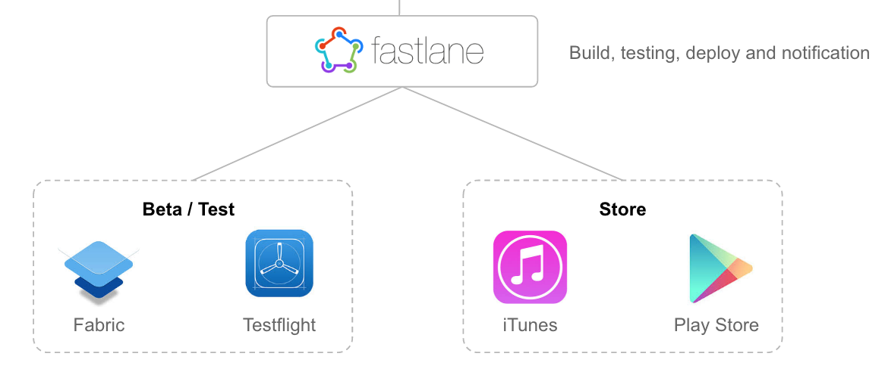

# Android Boilerplate
Sample Android app project as a reference pre-defined project. Save time of setup new projects.

Include in this project:

- Common libraries
- Distribution
- Requirements
- Setup

## Table of contents
- [Libraries](#libraries)
	- [Compile](#compile)
	- [AndroidTest](#androidtest)
	- [Test](#test)
- [Architecture](#architecture)
- [Distribution](#distribution)
	- [Workflow](#workflow)
	- [Crashlytics](#crashlytics)
	- [Play Store](#play-store)
	- [Commands](#commands)
- [Requirements](#requirements)
	- [Build](#build)
	- [Distribution](#distribution)
- [Setup](#setup)
- [License](#license)

## Libraries
### Compile
- AppCompat-v7
- Support-v4
- [Retrofit 2](https://square.github.io/retrofit/)
- [RxJava](https://github.com/ReactiveX/RxJava) & [RxAndroid](https://github.com/ReactiveX/RxAndroid)
- [ActiveAndroid](https://github.com/pardom/ActiveAndroid)
- [Picasso](http://square.github.io/picasso)
- [Crashlytics](https://fabric.io/kits/android/crashlytics)

### AndroidTest
- [Espresso](https://developer.android.com/training/testing/ui-testing/espresso-testing.html)
- [Screengrab](https://rubygems.org/gems/screengrab)

### Test
- JUnit

## Architecture
Free :)

Common architectures:

-  MVC (standard)
-  MVP
-  MVVM
-  Clean Architecture

## Distribution
This project can be distribute using a [Fastlane](http://fastlane.tools) which is the best automation release tool for mobile applications.

#### Workflow



#### Commands

Run these commands inside your project's root folder.

Take screenshots:

```
fastlane screenshots
```

Distribute on Google Play Store:

```
fastlane store
```

Distribute on [Crashlytics](https://fabric.io/kits/android/crashlytics):

```
fastlane beta group:dev
```

See [Fastfile](fastlane/Fastfile) for more details.

### Crashlytics

#### Setup
Add Crashlytics's keys in [/app/fabric.properties](app/fabric.properties):

```
apiSecret=[SECRET_KEY]
apiKey=[APIK_KEY]
```

#### Release notes
Update Crashlytics's release notes in [/fastlane/CrashlyticsFile](fastlane/CrashlyticsFile):

```
Description of Crashlytics release version
```

#### Distribute
Run Fastlane's command ```fastlane beta group:[GROUP]``` to distribute on Crashlytics:

**Example:**

Distribution for Crashlytics Beta 'dev' group

```
fastlane beta group:dev
```

*Important: Crashlytic's groups need to have already configured in Beta.

### Play Store

#### Setup
Add or replace Google Play Store API key json in [/google-play-api-key.js](google-play-api-key.json):

**Google Play Store JSON file:**

```
{
  "type": "service_account",
  "project_id": "",
  "private_key_id": "",
  "private_key": "",
  "client_email": "",
  "client_id": "",
  "auth_uri": "",
  "token_uri": "",
  "auth_provider_x509_cert_url": "",
  "client_x509_cert_url": ""
}

```

See documentation for [Collect your Google Credentials](https://docs.fastlane.tools/getting-started/android/setup#collect-your-google-credentials).

#### Release metadata
Update Google Play Store metadata. It's the most important step to distribute your app at Google Play Store:

If you have already had a published app:

- After setup Google Play Store key
- Run ```fastlane supply init```
- This will import all app's metadata from Google Play Store and store in:
	- /fastlane/metadata/android/[LANGUAGE]/images
	- /fastlane/metadata/android/[LANGUAGE]/full_description.txt
	- /fastlane/metadata/android/[LANGUAGE]/short_description.txt
	- /fastlane/metadata/android/[LANGUAGE]/title.txt
	- /fastlane/metadata/android/[LANGUAGE]/video.txt

If you haven't had a published app yet:

- Update icon and featureGraphic:
	- /fastlane/metadata/android/[LANGUAGE]/images
- Update all text descriptions:
	- 	/fastlane/metadata/android/[LANGUAGE]/full_description.txt
	-  /fastlane/metadata/android/[LANGUAGE]/short_description.txt
	-  /fastlane/metadata/android/[LANGUAGE]/title.txt
	-  /fastlane/metadata/android/[LANGUAGE]/video.txt
	
See documentation of [Fastlane Supply](https://github.com/fastlane/fastlane/tree/master/supply).

#### Take Screenshots

Run Fastlane's command ```fastlane screenshots``` to take screenshots from your App automatically. It's necessary that at least one device emulator running.

The configuration of screenshot proccess is in [fastlane/ScreengrabFile](fastlane/ScreengrabFile).

For more details about take screenshots automatically see [Fastlane Screenshots](https://docs.fastlane.tools/getting-started/android/screenshots)

#### Distribution

Run Fastlane's command ```fastlane store``` to distribute on Google Play Store:

## Requirements
### Build

- JDK 1.8
- Android SDK
- Android SDK Build tools

### Distribution

- Ruby 2.0.0+
- [Fastlane](http://fastlane.tools)
- [Screengrab](https://rubygems.org/gems/screengrab)

## Setup

- Download or clone this repository
- Rename app package
	- Current is com.boilerplate.android
- Rename app name
	- app/res/values/string.xml
- Setup your Fabric and Crashlytics keys
	- 	See [Crashlytics setup](#crashlytics)
	-  app/fabric.properties
-  Setup your Google Play Store API
	-  	See [Google Play Store setup](#play-store)
	-   google-play-store-api-key.json

## License

```
    Copyright 2016 Rafael Matias. 

    Licensed under the Apache License, Version 2.0 (the "License");
    you may not use this file except in compliance with the License.
    You may obtain a copy of the License at

       http://www.apache.org/licenses/LICENSE-2.0

    Unless required by applicable law or agreed to in writing, software
    distributed under the License is distributed on an "AS IS" BASIS,
    WITHOUT WARRANTIES OR CONDITIONS OF ANY KIND, either express or implied.
    See the License for the specific language governing permissions and
    limitations under the License.
```

